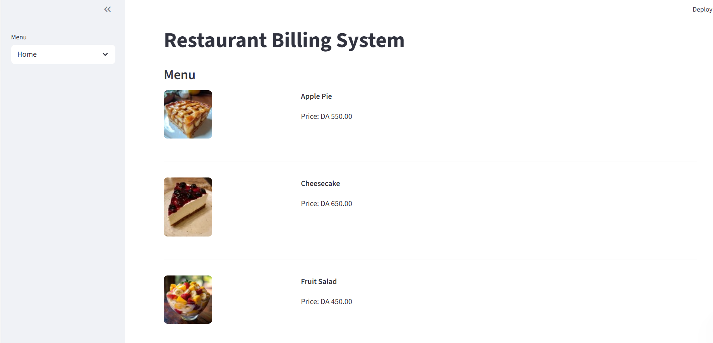
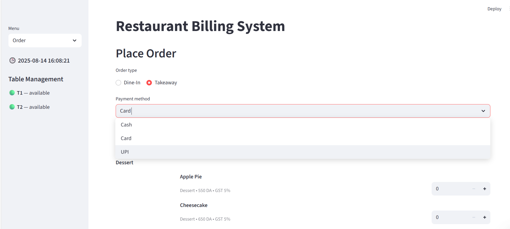
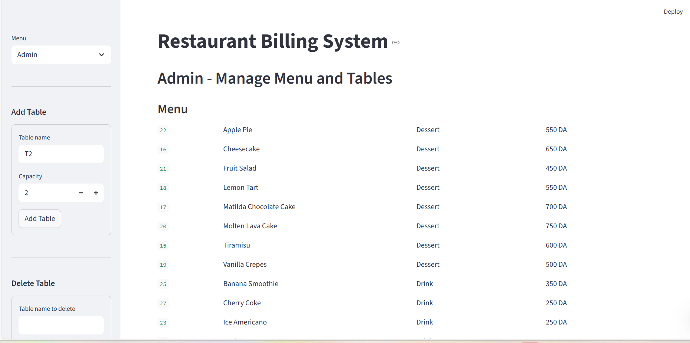
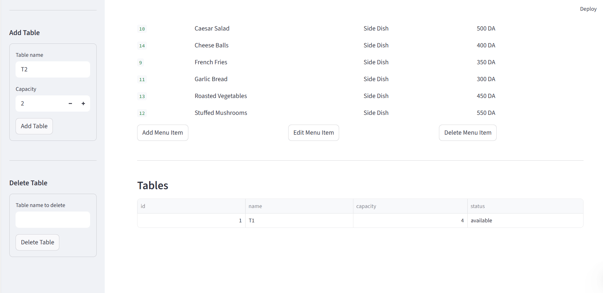
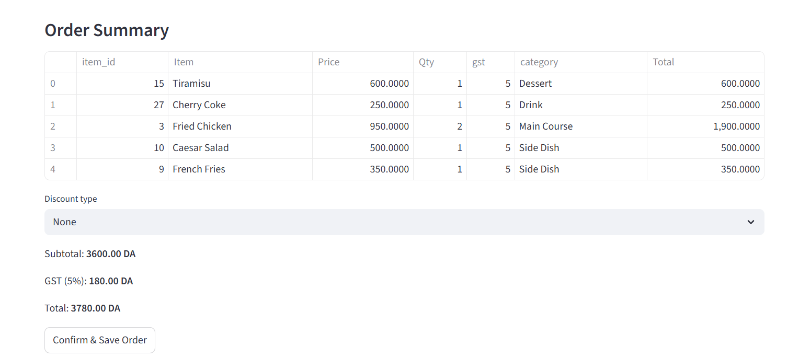

# 🍽 Restaurant Billing System

A complete restaurant management and billing solution built with **Python**, **Streamlit**, and **SQLite**.  
This system allows restaurants to manage their menu, handle orders, generate bills, and track sales reports all in a simple, intuitive interface.

---

##  Screenshots

###  Home Page

###  Takeaway / Dine-In + Payment Method

###  Admin – Menu Management

###  Admin – Table Management

###  Order Summary

---

##  Features

-  **Home Page** – Browse menu items with images, categories, and prices.
-  **Order Page** – Select items, quantities, and order type (Dine-In / Takeaway).
-  **Payment Method** – Choose between Cash or Card.
-  **Discount Options** – Apply percentage or fixed discounts.
-  **Order Summary** – Review items, prices, discounts, and total before confirming.
-  **Order Storage** – Orders are saved to `data/sample_bills.json`.
-  **Menu Management** – Add, edit, delete menu items with images and prices.
-  **Table Management** – Add tables with seating capacity or delete them.
-  **Reports** – View daily, weekly, and monthly sales + best-selling items.
-  **Persistent Storage** – All data stored in `SQLite` and `sales_report` files.

---

##  Technologies Used
- **Python** – Main programming language.
- **Streamlit** – Web application framework.
- **SQLite** – Database for persistent storage.
- **Pandas** – Data manipulation.
- **JSON** – For storing orders.
- **OS** – File and path management.

---

##  How It Works

1. **Start Order** – Click "Order" on the sidebar.
2. **Choose Order Type** – Dine-In or Takeaway.
3. **Select Payment Method** – Cash, UPI or Card.
4. **Pick Items** – Choose menu items and set quantities.
5. **Apply Discount** – Optional percentage or fixed discount.
6. **Review Order Summary** – View full details.
7. **Save Order** – Stored in `data/sample_bills.json`.
8. **Menu Management** – Add, update, or delete menu items.
9. **Table Management** – Manage tables and seating capacity.
10. **View Reports** – Access daily, weekly, monthly sales and best-sellers.
11.  **Data Storage** – Reports are saved as CSV files in the `data/` folder.

## Installation & Running the Project

1. **Clone the repository**  
`git clone https://github.com/ikramghl/Restaurant_Billing_System.git`  
`cd Restaurant_Billing_System`

2. **Install dependencies**  
`pip install -r requirements.txt`

3. **Run the application**  
`streamlit run app.py`

4. **Open in browser**  
Open the URL shown in your terminal (usually: http://localhost:8501)

